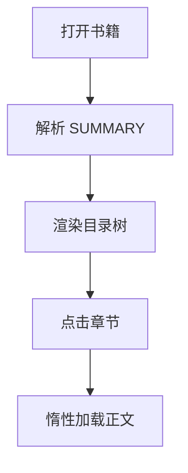
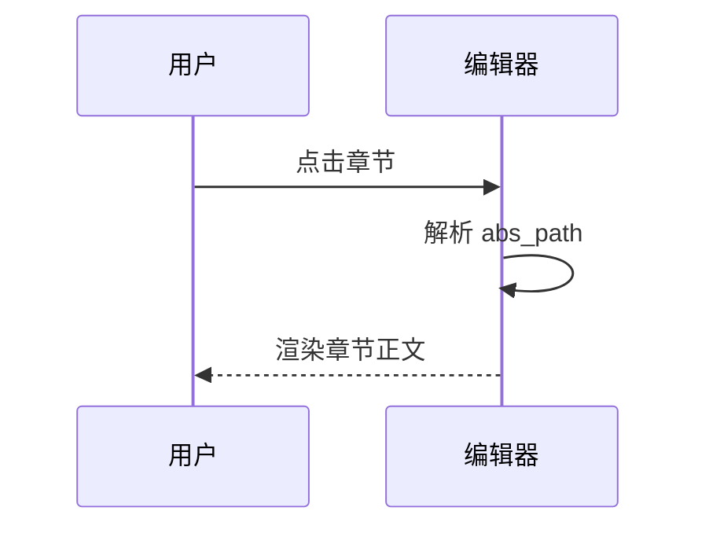

# 图片与图表

mdEditor 支持本地图片与 Mermaid 图表。

## Mermaid 流程图

```mermaid
graph TD
    A[打开书籍] --> B[解析 SUMMARY]
    B --> C[渲染目录树]
    C --> D[点击章节]
    D --> E[惰性加载正文]
```

## Mermaid 时序图

```mermaid
sequenceDiagram
    participant 用户
    participant 编辑器
    用户->>编辑器: 点击章节
    编辑器->>编辑器: 解析 abs_path
    编辑器-->>用户: 渲染章节正文
```

## 相关章节

- 返回 [排版与格式](formatting.md)
- 继续 [书籍模式详解](../advanced/book-mode.md)
- 回到 [简介](../README.md)
